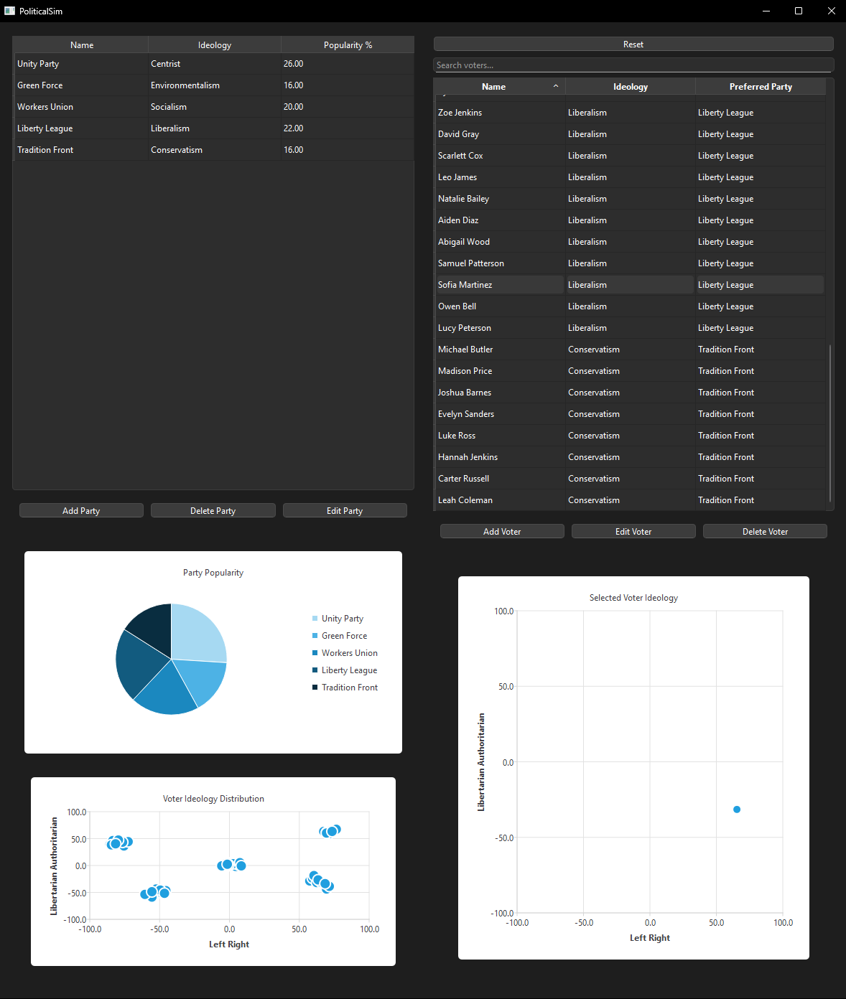

# PoliticalSim

**PoliticalSim** is a simple political alignment simulation tool created as a student software engineering project. It allows you to create and manage political parties and voters, placing them on a two-dimensional ideological spectrum.

The goal is to visualize how voters align with the nearest party ideologically and to demonstrate object-oriented programming concepts in a GUI application (built with C++/Qt and an SQLite database backend).
The interface is straightforward and not meant for a serious commercial audience – it's a learning project, so I'm focusing on clarity and core functionality over polish or complexity.

---
## UI Overview



The app has a two-panel layout:

- **Left: Parties**
  - Table with party name, ideology (coordinates), and % of voter support
  - Buttons:
    -  Add Party → opens input dialog (name, political coodrinates), auto-assigns ideology label
    -  Edit Party → change name or coordinates
    -  Delete Party → removes party, voters keep old party_id

- **Right: Voters**
  - Table with voter name, ideology, and preferred party
  - Buttons:
    -  Add Voter → dialog (name, political coodrinates), assigns closest party + ideology
    -  Edit Voter → update position, reassigns party if needed
    -  Delete Voter
    -  Search Bar → filters voter table live

- **Bottom Charts**
  -  Pie Chart → shows party popularity by % of voters, visually much clearer than in table
  -  Scatter Plot → shows all voter positions on a 2D ideology compass
  -  Focus Chart → shows one selected voter’s coordinates

---
## Features

- Add, edit, and delete political parties
- Add, edit, and delete voters
- Each voter is automatically assigned to the closest party (Euclidean distance)
- Voter alignment is visualized in:
  - A 2D scatter plot of ideology positions
  - A pie chart showing party popularity
- Voter preferences and party data are stored persistently in an SQLite database
- Party popularity is calculated in real time
- Voter search/filter functionality in table view
- Reset feature restores default party and voter data

---

## UI Overview

**Party Managment:**
You can add new parties with a custom name and ideology coordinates, edit existing parties’ details, or remove parties. The app automatically links a party to the nearest predefined 
ideology (e.g. “Centrist”, “Socialism”, etc.) based on the coordinates you enter. Party changes trigger UI refreshes so the tables and charts stay up to date.

**Voter Management:**
Similarly, you can add voters by entering a name and their ideological position (X and Y). The program will immediately assign the voter to whichever party’s ideology is closest to that position, and tag the voter with the nearest ideology label.
You don’t choose the party manually – it’s determined by the coordinates. You can also edit a voter (which allows changing their coordinates/name and will potentially reassign their party if their ideology moved) or delete a voter. All these operations update the interface and charts in real-time.

**Search and Filter:**
The voter list supports case-insensitive filtering. As you type text in the “Search voters...” field, the list filters to show only matching entries 
(this checks all columns, so you can search by name, ideology, or party). This makes it easier to find a specific voter in a long list.

**Data Visualization:**
The pie chart gives an instant view of party popularity by percentage of voters.
The scatter plot provides a visual distribution of all voter ideologies in the 2D political compass space. By selecting a voter in the table, their exact position is highlighted in the single-voter chart for closer inspection.
These visual tools help to quickly understand how voters cluster around parties or ideologies.

**Reset to Default Scenario:**
At any time, you can click Reset to wipe the current data and restore the initial state with a set of default parties and voters.
The default data includes five example parties (e.g. Unity Party, Green Force, Workers Union, etc.) with predefined ideology coordinates, and a pre-populated list of sample voters spread across the ideological spectrum.
This is handy if you want to start over or see a demo scenario. (A confirmation dialog will appear to prevent accidental resets.)

**Persistent Storage:**
All data is stored in a SQLite database file (politicalsim.sqlite). Parties and voters you add or edit are saved there via the data models.
This means your changes persist between runs (unless you hit Reset). Under the hood, the app creates tables for parties, voters, and ideologies if they don’t exist.
The default ideology definitions (like Centrist, Socialism, etc.) are inserted on first run. While the README doesn’t delve into installation, just note that the app manages the DB file automatically.

---

## Limitations and Unimplemented Features

  **Ideology Definitions are Fixed:**
  The ideological compass points (Centrist, Environmentalism, Socialism, Liberalism, Conservatism by default) are hard-coded and not modifiable through the UI.
  The app automatically picks whichever of these is closest to a given coordinate for display, but you cannot add new ideology categories or adjust their coordinates via the interface.
  The ideology combo boxes in the dialogs are read-only – they just show the nearest label. Essentially, the political spectrum grid is predefined and static.

  **Simplified Simulation:**
  This project focuses on the static distribution of voters and parties. There are no features for simulating elections, voter turnout, changing voter opinions over time, or any dynamic gameplay.
  It’s not a full election simulator – there’s no “run simulation” button or time progression. All of it was in original scope but, alas, not completed in time

  **Limited Data Validation:**
  Some input validation and polish are minimal. For instance, nothing stops you from creating parties or voters with duplicate names or leaving the name blank (though a blank name would just display as empty).
  There is no detailed error messaging for invalid inputs aside from what Qt provides by default. I assume well-behaved input for demonstration purposes.

  **UI/UX Niggles:**
  The user interface, while functional, is basic. The tables use Qt’s default look and feel. There’s no custom drag-and-drop or reordering beyond the built-in sorting on the voter table.

Overall, the current state of the project is a working demo of the core functionality, but not a comprehensive simulation. I aimed to implement the critical features to meet the project requirements, and I have documented honestly where features are missing or simplified.

---

## Design Patterns in PoliticalSim

### Observer Pattern
The **Observer pattern** is extensively used in PoliticalSim through Qt's signal-slot mechanism. Model classes (e.g., `PartyModel`, `VoterModel`) act as subjects that emit signals when their data changes,
while other components (views, charts, or other models) act as observers by connecting to these signals. For example, `PartyModel` defines signals like `partyAdded`, `partyUpdated`, and `partyDeleted` to notify when parties are
modified. The `PartyModel` also observes `VoterModel` – in its `setVoterModel` method it connects voter-related signals to its own slot for recalculating popularity.
This way, when a voter is added or edited, the `VoterModel` emits an event and the `PartyModel` automatically updates derived data (party popularity) and notifies the UI.

```cpp
// In PartyModel::setVoterModel, connect VoterModel signals to PartyModel slot (Observer pattern)
connect(model, &VoterModel::voterAdded,    this, &PartyModel::recalculatePopularityFromVoters);
connect(model, &VoterModel::voterUpdated,  this, &PartyModel::recalculatePopularityFromVoters);
connect(model, &VoterModel::voterDeleted,  this, &PartyModel::recalculatePopularityFromVoters);
```

Here, `VoterModel` is the subject that emits `voterAdded/Updated/Deleted`, and `PartyModel::recalculatePopularityFromVoters` is the observer action.
Similarly, the GUI charts connect to model signals (e.g. `PartyModel::dataChangedExternally`, `VoterModel::voterAdded`) to refresh displays whenever data changes.
This event-driven design decouples the models from the views, following the Observer pattern.

### Proxy Pattern
PoliticalSim uses Qt’s `QSortFilterProxyModel` as an implementation of the **Proxy pattern** for the voter list filtering. The `VoterModel` provides all voter data, and a `QSortFilterProxyModel` instance (`voterProxyModel`)stands in front of it to filter search results without altering the original model.
The proxy model has the same interface as the real model (it’s a subclass of `QAbstractItemModel`) and forwards data requests to the `VoterModel` but can modify the results (e.g., filtering by name).
In the code, the proxy is set up by assigning the `VoterModel` as its source and then using the proxy in the view:

```cpp
voterProxyModel = new QSortFilterProxyModel(this);
voterProxyModel->setSourceModel(voterModel);
ui->voterTableView->setModel(voterProxyModel);  // View uses proxy instead of direct model
```

Here, `voterProxyModel` controls access to the underlying `voterModel`, functioning as a stand-in that filters or sorts data before it reaches the UI.

### Adapter Pattern
The application’s model classes serve as adapters between the database and the UI, which corresponds to the **Adapter pattern**. They convert the raw data storage interface (SQLite database and in-memory records) into the interface that the Qt view expects (`QAbstractTableModel`).
For example, `PartyModel` loads party records from SQLite into a `QVector<Party>` and exposes them via the standard model methods (`rowCount`, `data`, etc.).
In doing so, it transforms low-level database fields into higher-level, user-friendly values. Notably, it uses an `IdeologyModel` to map ideology IDs to human-readable ideology names when providing data.
During data loading, `PartyModel` queries the `IdeologyModel` for the name of each party’s ideology and stores it, so that its `data()` can return the ideology name string instead of a numeric ID.
Likewise, `PartyModel::data` combines information from multiple sources (party name, ideology name, and a calculated popularity percentage) into the format needed by the view:

```cpp
if (role == Qt::DisplayRole) {
    switch (index.column()) {
    case 0: return party.name;            // Party name
    case 1: return party.ideology;        // Ideology name (adapted from ID)
    case 2:
        if (voterModel) {
            double pct = calculatePopularity(party.id);
            return QString::number(pct, 'f', 2);  // Popularity percentage
        } else return "0.00";
    }
} else if (role == Qt::UserRole) {
    return party.id;  // Provide raw ID for internal use
}
```

Here the model adapts internal data into view-friendly outputs: for example, it returns `party.ideology` (a name string) for display, which was originally looked up via `IdeologyModel` (adapting an ID to a name).
By implementing Qt’s model interface, `PartyModel` and `VoterModel` let the UI treat database-backed data as ordinary table models. This decouples the UI from the database schema, fulfilling the role of an Adapter.

## Mediator Pattern
The `MainWindow` class plays a coordinating role that resembles the **Mediator pattern**. Rather than having UI widgets and models communicate directly, `MainWindow` centralizes their interactions.
For example, when the user clicks the "Add Party" button, `MainWindow` opens an `AddPartyDialog`, supplies it with the `IdeologyModel` for lookups, and then—if the user confirms—passes the new party data to the `PartyModel` to create a party record.
The dialog itself doesn’t modify the `PartyModel` directly; instead, `MainWindow` serves as an intermediary between the dialog and the model:

```cpp
connect(ui->addPartyButton, &QPushButton::clicked, this, [=]() {
    AddPartyDialog dialog(this);
    dialog.setIdeologyModel(ideologyModel);
    if (dialog.exec() == QDialog::Accepted) {
        partyModel->addParty(dialog.getParty());
    }
});
```

Similarly, `MainWindow` mediates other actions (editing or deleting parties/voters, updating charts on selection changes, etc.), ensuring that UI components (dialogs, tables, charts) and data models interact only through this central hub.
This approach aligns with the Mediator pattern by reducing direct coupling among the various parts of the application.

## Facade Pattern

The model classes (`PartyModel`, `VoterModel`, etc.) act as a simplified interface to complex operations involving the database and related data.
Instead of the UI or other components having to manage SQL queries, data conversions, and updates across multiple tables, the models provide high-level methods that internally handle those details.
For instance, adding a new party is done via `PartyModel::addParty()`, which hides all the SQL insert logic and related updates behind a single call:

```cpp
// Adding a party via PartyModel (facade to DB and related updates)
void PartyModel::addParty(const Party &party) {
    QSqlDatabase db = QSqlDatabase::database(m_connectionName);
    if (!db.isOpen()) { /* ... */ return; }
    QSqlQuery query(db);
    query.prepare("INSERT INTO parties (...) VALUES (:name, :ideology_id, :ix, :iy)");
    query.bindValue(":name", party.name);
    query.bindValue(":ideology_id", party.ideologyId);
    query.bindValue(":ix", party.ideologyX);
    query.bindValue(":iy", party.ideologyY);
    if (!query.exec()) { qWarning() << "[PartyModel] Insert failed:" << query.lastError().text(); return; }
    emit partyAdded();
    if (voterModel) { voterModel->reassignAllVoterParties(); }
    emit dataChangedExternally();
}
```
Here, the UI simply calls `partyModel->addParty(...)` and the model facades the details: it executes the SQL insert, emits signals (which observers pick up), and even triggers a voter reassignment to update all related data.
Similarly, when loading data, `PartyModel` pulls together information from multiple sources (the party table and the `IdeologyModel` for names) and presents it in one unified form.
In the snippet below, `PartyModel::reloadData()` queries the DB and uses the `IdeologyModel` to translate ideology IDs to names, all hidden behind the model’s interface:

```cpp
// PartyModel reloads data, combining DB records with ideology names (facade to DB + IdeologyModel)
while (query.next()) {
    Party party;
    party.id = query.value(0).toInt();
    party.name = query.value(1).toString();
    party.ideologyId = query.value(2).toInt();
    party.ideology = (ideologyModel ? ideologyModel->getIdeologyNameById(party.ideologyId) : QString());
    party.ideologyX = query.value(3).toInt();
    party.ideologyY = query.value(4).toInt();
    m_parties.append(party);
}
:contentReference[oaicite:4]{index=4}
```
By providing a single point of interaction for party data (add, update, delete, load, etc.), `PartyModel` and its peers function like facades – they shield the rest of the application from the complexities of SQL, data mapping, and cross-model coordination.

---

## Development Notes

**This project was created to demonstrate:**

- Use of Qt for GUI development
- Proper separation of concerns using MVC
- Application of common GoF design patterns
- Real-time interaction with persistent data
- Clean class interfaces and responsibilities

**Planned but not yet implemented features include:**

- Ideology add/edit/delete
- Simulation of events that would affect the situation
- Simulation of election with all of its derivitives
- Some kind of Log field
- Enhanced error handling and validation
- Full unit test coverage

**The application successfully delivers a working interactive prototype with dynamic data models, basic charting, and strong architectural foundations within limited development time.**

